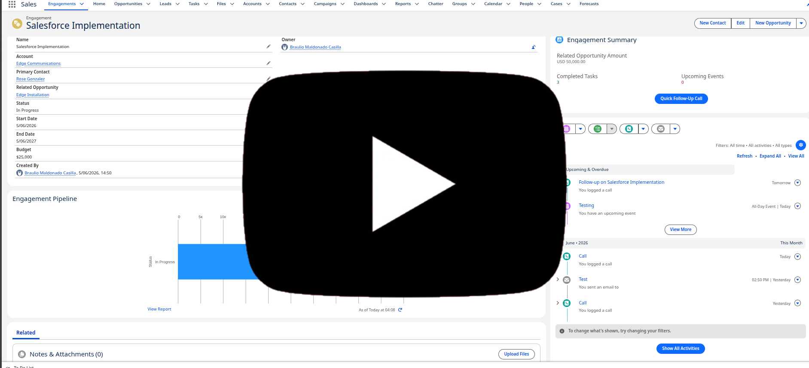
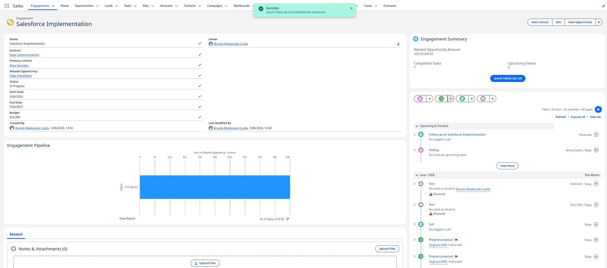
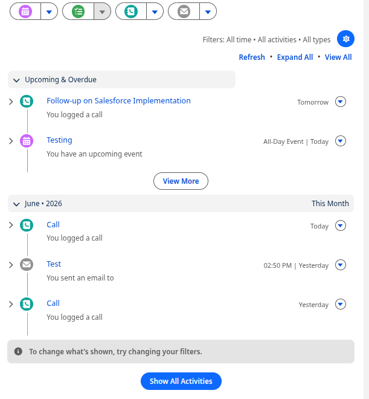
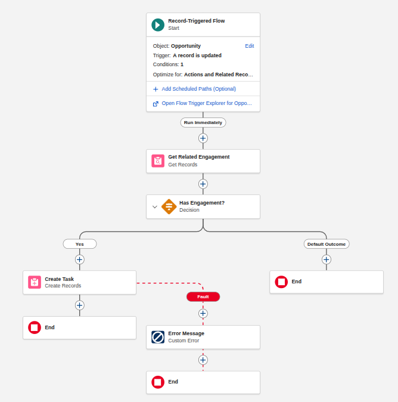
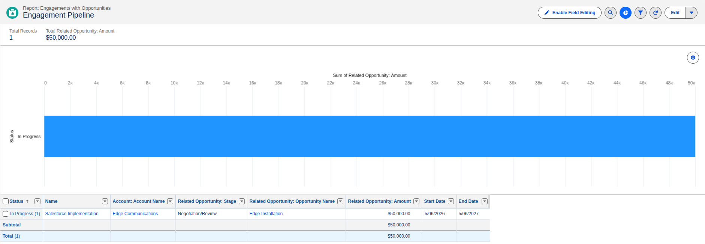
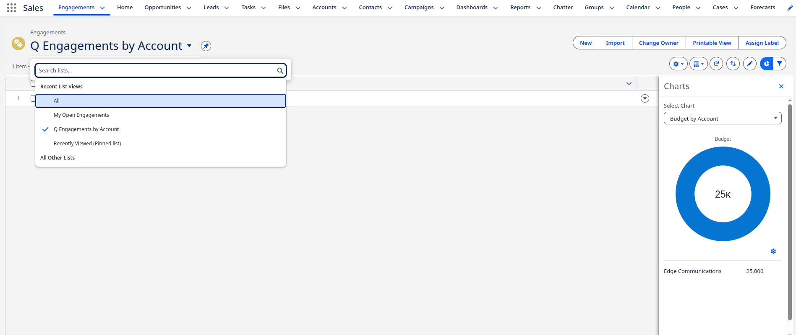

# Salesforce Engagement & Opportunity Tracker

By Braulio Maldonado Casilla

## 1. What I Built & Assumptions

**What I built:** A custom Salesforce application to track, manage, and automate "Engagements" linked to Opportunities. It features a custom data model, Lightning Record Pages, custom List Views, a Record-Triggered Flow for automation, Custom Report Types for analytics, and a reactive Lightning Web Component (LWC) powered by Apex and the UI API.

**Assumptions:**

- The `Engagement__c` object is configured to "Allow Activities" to track tasks, calls, and events.
- Engagements are linked to a primary Opportunity via a Lookup relationship.
- Standard Activity tracking and Email Deliverability ("All email") are enabled in the org to allow proper communication testing.

---

## 2. How to Test Each Item

- **#2 Activities:** Navigate to an Engagement record. Use the Activity Timeline on the right to log a call, send an email, and create a new event.
- **#3 App Builder (Record Page):** Open any Engagement record to view the custom layout. Verify the Highlights Panel at the top, the "Details" and "Related" tabs in the center, and the dedicated "Activities" section on the right.
- **#4 List Views:** Navigate to the Engagements tab. Select the "My Open Engagements" list view to see records filtered by Status (excluding "Completed"). Select "Q Engagements by Account", click the Chart icon, and view the "Budget by Account" Donut chart.
- **#5 LWC + Apex:** Open an Engagement record and locate the "Engagement Summary" LWC on the top right. It dynamically displays the related Opportunity Amount, Completed Tasks, and Upcoming Events. Click the "Quick Follow-Up Call" button to instantly schedule a Task for the next day via the UI API.
- **#6 Flow Automation:** Open an Opportunity that is NOT in "Negotiation/Review" and ensure it has a related Engagement. Update the Opportunity Stage to "Negotiation/Review" and save. Navigate to the related Engagement and verify a High-Priority Task named "Prepare proposal" was automatically created for a future business day.
- **#7 Reporting:** Navigate to the Reports tab and open the "Engagement Pipeline" report. Verify it displays a Bar Chart summarizing the "Sum of Amount" grouped by "Status". Return to an Engagement record to see this exact chart contextually embedded and dynamically filtered by the current record ID.

---

## 3. Links/Paths to LWC and Apex

- **LWC Bundle:** [`./force-app/main/default/lwc/engagementSummary/`](./force-app/main/default/lwc/engagementSummary/) (includes `.js`, `.html`, `.xml`, and `__tests__`)
- **Apex Controller:** [`./force-app/main/default/classes/EngagementController.cls`](./force-app/main/default/classes/EngagementController.cls) (and `.cls-meta.xml`)

---

## 4. Report and List View Names

- **Custom Report Type:** `Engagements with Opportunities`
- **Report Name:** `Engagement Pipeline`
- **List View Names:** `My Open Engagements` and `Q Engagements by Account`

---

## 5. Visual Evidence

**Full Video Walk-through:**

---

- **1. Engagement record page + your LWC**

  

- **2. Logging a call / email / event**

  

- **3. The Flow firing**

  

- **4. The report + chart**

  

- **5. List view chart**

  
